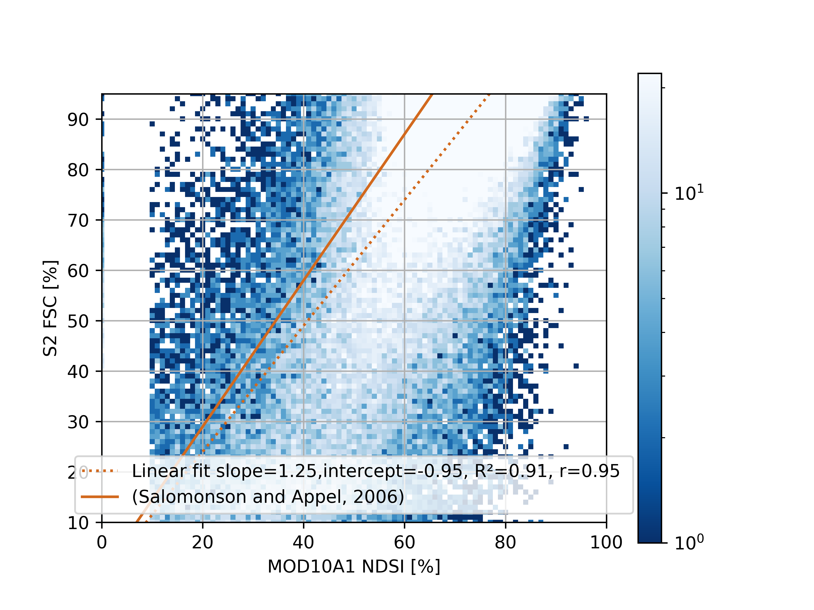

# ndsi_fsc_calibration

 

## Description
Fit a linear model for Normalized Snow Index (NDSI) to Fractional Snow Cover (FSC) for moderate resolution sensors using Sentinel-2 as high resolution reference.

This code automizes the following ste ps:
1. Download of VIIRS/MODIS and Sentinel-2 source data on an area of interest
2. Regrid Sentinel-2 FSC on VIIRS/MODIS grid (specify another frid is also possible)
3. Match evaluation and reference datasets: for each combination of VIIRS/MODIS NDSI (0 to 100 %) and Sentinel-2 FSC (0 to 100 %), compute the number of occurrences
4.  Fit a linear regression on the (NDSI, FSC) dataset obtained in step 3
5. Visualize result with a scatter plot

```bash
$ tree
.
├── conf
│   └── grid_conf_example.yaml
├── data
│   ├── aoi_files
├── output_folder
├── pdm.lock
├── pyproject.toml
├── README.md
├── scripts
│   ├── launch.sh
│   └── main.py
├── src
│   └── ndsi_fsc_calibration
│       ├── download.py
│       ├── fit_linear_model.py
│       ├── __init__.py
│       ├── match.py
│       ├── regrid.py
│       ├── snow_cover_products.py
│       ├── utils.py
└──     └── visualization.py
```

## Usage

See `scripts/launch.py`

Examples:

Launch main on the Dolomites between 1/12/2023 and 1/1/2024 for VJ210A1 (VIIRS JPSS-2 snow cover product) and trigger automatic data download from earthaccess (VJ210A1) and Py Hydroweb (Sentinel-2)

```bash
python scripts/main.py \
--start_date 20231201 \
--end_date 20240101 \
--aoi_file ./data/aoi_files/dolomites.geojson \
--product_name VJ210A1 \
--sentinel_2_folder ./data/S2_THEIA/ \
--nasa_folder ./data/V10A1/VJ210A1/ \
--output_folder ./output_folder/ \
--download_nasa
--download_s2
```

Launch main on the French Alps between 1/12/2023 and 1/1/2024 for MOD10A1 (MODIS Terra snow cover product) without triggering automatic download -> source data are assumed to be already available in sentinel_2_folder and nasa_folder

```bash
python scripts/main.py \
--start_date 20231201 \
--end_date 20240101 \
--aoi_file ./data/aoi_files/alpes_bbox.shp \
--product_name MOD10A1 \
--sentinel_2_folder ./data/S2_THEIA/ \
--nasa_folder ./data/MOD10A1/ \
--output_folder ./output_folder/ 
```

Launch main on the French Alps between 1/12/2023 and 1/1/2024 for VNP10A1 (VIIRS SNPP snow cover product) without triggering automatic download and specifying a custom resampling grid

```bash
python scripts/main.py \
--start_date 20231201 \
--end_date 20240101 \
--aoi_file ./data/aoi_files/alpes_bbox.shp \
--product_name VJ210A1 \
--sentinel_2_folder ./data/S2_THEIA/ \
--nasa_folder ./data/V10A1/VJ210A1/ \
--output_folder ./output_folder/ \
--resampling_grid_file ./conf/grid_conf_example.yaml
```
